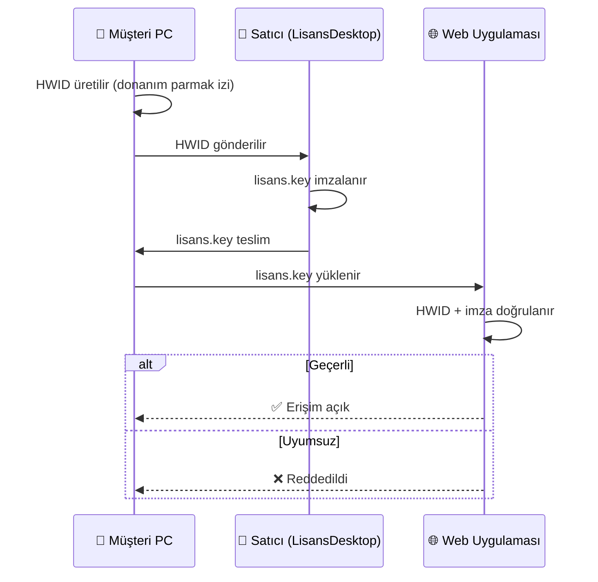

<div align="center">


<br/>

[](https://dotnet.microsoft.com/)
[](https://learn.microsoft.com/aspnet/core/blazor/)
[](https://www.postgresql.org/)
[](https://learn.microsoft.com/ef/core/)
[](https://getbootstrap.com/)
[](https://ollama.com/)

[](https://github.com/karamur/KOAFiloServis/actions)
[](https://github.com/karamur/KOAFiloServis/actions/workflows/tests.yml)
[](https://codecov.io/gh/karamur/KOAFiloServis)
[](https://github.com/karamur/KOAFiloServis/security/code-scanning)
[](https://github.com/karamur/KOAFiloServis/commits/main)
[](https://github.com/karamur/KOAFiloServis/issues)
[](https://github.com/karamur/KOAFiloServis/stargazers)
[](https://github.com/karamur/KOAFiloServis)
[](https://github.com/karamur/KOAFiloServis)
[](https://github.com/karamur/KOAFiloServis)
[](LICENSE)
[](CODE_OF_CONDUCT.md)

<br/>

> 🚚 **Taşımacılık ve lojistik firmaları** için araç, sürücü, muhasebe, bordro, EBYS, CRM ve ihale süreçlerini tek platformda birleştiren **modüler**, **çok firmalı** ve **AI destekli** kurumsal ERP çözümü.

<br/>

**📚 [Kurulum](#-kurulum)** &nbsp;•&nbsp; **✨ [Özellikler](#-öne-çıkan-özellikler)** &nbsp;•&nbsp; **🧩 [Mimari](#-mimari)** &nbsp;•&nbsp; **⚙️ [Yapılandırma](#️-yapılandırma)** &nbsp;•&nbsp; **🧪 [Test](#-test--kalite)** &nbsp;•&nbsp; **📦 [Yayınlama](#-yayınlama)** &nbsp;•&nbsp; **🤝 [Katkı](#-katkı)** &nbsp;•&nbsp; **📋 [Changelog](CHANGELOG.md)**

<br/>

</div>

---

## 📖 Genel Bakış

**KOAFiloServis**, filo ve taşımacılık şirketlerinin tüm operasyonlarını tek platformdan yönetebilmesi için geliştirilmiş **modüler** ve **çok firmalı (multi-tenant)** bir kurumsal ERP çözümüdür.

Araç yönetiminden bordro hesaplamaya, ihale süreçlerinden e-fatura entegrasyonuna kadar **200+ ekran** ile uçtan uca dijital dönüşüm sağlar. Tüm uygulama tamamen **açık kaynak ve ücretsiz araçlar** üzerine kurulmuştur — herhangi bir ücretli SaaS bağımlılığı yoktur.

<table>
<tr>
<td align="center" width="33%">

### 🏢 Kimler İçin?
Filo yönetim firmaları, lojistik şirketleri, taşımacılık operatörleri, servis ve muhasebe ekipleri için.

</td>
<td align="center" width="33%">

### 🧩 Ne Sunar?
Araç & sürücü, muhasebe, bordro, EBYS, ihale, raporlama ve **AI destekli analiz** modülleri.

</td>
<td align="center" width="33%">

### ⚡ Teknoloji
.NET 10 + Blazor Server + EF Core 10 + PostgreSQL/SQLite + Ollama AI — tamamı **ücretsiz**.

</td>
</tr>
</table>

---

## ✨ Öne Çıkan Özellikler

<details open>
<summary><b>🚛 Filo & Operasyon Yönetimi</b></summary>

- 🚗 Araç envanteri, ruhsat, sigorta, muayene takibi
- 📍 Güzergah & sefer yönetimi, GPS konum geçmişi
- 🔧 Bakım/onarım planlaması, masraf takibi
- ⛽ Yakıt tüketim raporları & verimlilik analizi
- 👨‍✈️ Sürücü atama, ehliyet/SRC takibi
- 📦 İlan yayınlama, ihale süreçleri, hak ediş hesabı

</details>

<details>
<summary><b>💰 Muhasebe & Finans</b></summary>

- 📊 Genel muhasebe, mizan, defter, KDV
- 🧾 e-Fatura / e-Arşiv entegrasyon altyapısı
- 🏦 Banka hesabı & hareket eşleşmesi
- 💵 Cari hesap, tahsilat & ödeme takibi
- 📈 Bütçe planlaması ve gerçekleşme analizi
- 📑 Hak ediş, masraf merkezi, proje bazlı raporlama

</details>

<details>
<summary><b>👥 İK & Bordro</b></summary>

- 👤 Personel özlük, izin, vardiya, fazla mesai
- 💸 Bordro hesaplama, SGK & gelir vergisi tahakkuku
- 📅 Puantaj ve hak ediş kalemleri
- 📋 EBYS (Elektronik Belge Yönetim Sistemi) entegrasyonu

</details>

<details>
<summary><b>🤖 AI Destekli Akıllı Modüller</b></summary>

- 💬 **Ollama tabanlı sohbet asistanı** (tamamen yerel, ücretsiz, GPU/CPU)
- 📄 EBYS belge OCR, otomatik sınıflandırma & özetleme
- 🔍 Cari/fatura/sözleşme bağlamlı akıllı arama
- 🧠 `Microsoft.Extensions.AI` ile sağlayıcı bağımsız mimari

</details>

<details>
<summary><b>🔔 CRM & Bildirim</b></summary>

- 🗂️ Müşteri/cari kart yönetimi, fırsat takibi
- 📞 Çağrı/görüşme notları, destek talepleri
- 🔕 Gerçek zamanlı bildirim merkezi (panel + dropdown)
- ⌨️ Klavye kısayolları & global arama

</details>

<details>
<summary><b>🔐 Güvenlik & Çok Kullanıcılı Mimari</b></summary>

- 🔑 JWT + cookie tabanlı **iki faktörlü** kimlik doğrulama
- 👮 Detaylı **rol & yetki** matrisi (200+ izin kalemi)
- 🏢 **Multi-tenant** firma izolasyonu, dönem bazlı veri ayrımı
- 🔒 HWID tabanlı offline lisans (donanım parmak izi)
- 🛡️ ASP.NET Core Data Protection ile şifrelenmiş anahtar yönetimi

</details>

---

## 🛠️ Teknoloji Yığını <sub>(Tamamı Ücretsiz / Açık Kaynak)</sub>

| Katman | Kullanılan Araç | Lisans |
|---|---|---|
| **Backend** | .NET 10, ASP.NET Core, Blazor Server | MIT |
| **ORM** | Entity Framework Core 10 | MIT |
| **Veritabanı** | PostgreSQL · MySQL · SQLite · SQL Server | PostgreSQL / GPL / Public Domain / EULA |
| **UI** | Bootstrap 5, Bootstrap Icons | MIT |
| **Auth** | JWT Bearer, ASP.NET Core Identity, Data Protection | MIT |
| **Cache** | In-Memory · Redis (StackExchange.Redis) | MIT |
| **Excel** | ClosedXML · EPPlus (NonCommercial) | MIT / LGPL |
| **PDF** | QuestPDF | MIT (Community) |
| **Mail** | MailKit | MIT |
| **AI** | Microsoft.Extensions.AI · OllamaSharp · **Ollama (local)** | MIT / Apache 2.0 |
| **Scheduler** | Quartz.NET | Apache 2.0 |
| **Test** | xUnit · Coverlet · Playwright · Selenium | MIT / Apache 2.0 |
| **CI/CD** | **GitHub Actions** (ücretsiz tier) | — |
| **Installer** | **Inno Setup 6** | Free for any use |
| **IDE** | Visual Studio Community / VS Code + C# Dev Kit | Free |

> 💡 Hiçbir ücretli SaaS, lisanslı bileşen veya kapalı kaynak servis kullanılmaz.

---

## 🧩 Mimari

```mermaid
flowchart LR
    subgraph Client["🌐 İstemci"]
        B[Blazor Server UI<br/>Bootstrap 5 + Icons]
    end

    subgraph Web["🔵 KOAFiloServis.Web (.NET 10)"]
        API[REST API<br/>+ SignalR]
        SVC[Service Layer<br/>200+ Servis]
        EF[EF Core 10<br/>Multi-Provider]
        AI[AI Layer<br/>Ollama + MEAI]
        BG[Background Jobs<br/>Quartz.NET]
    end

    subgraph Data["🗄️ Veri"]
        PG[(PostgreSQL)]
        SQL[(SQL Server)]
        MY[(MySQL)]
        LITE[(SQLite)]
        RDS[(Redis Cache)]
    end

    subgraph Tools["🖥️ Yardımcı Araçlar"]
        LIS[LisansDesktop<br/>WinForms / HWID]
        DS[DataSync<br/>PG ↔ SQLite]
    end

    subgraph External["🌍 Dış Servisler (Opsiyonel)"]
        OLLA[Ollama Server]
        SMTP[SMTP / MailKit]
        EFAT[e-Fatura Sağlayıcı]
    end

    B <--> API
    API --> SVC
    SVC --> EF
    SVC --> AI
    SVC --> BG
    EF --> PG & SQL & MY & LITE
    SVC --> RDS
    AI --> OLLA
    SVC --> SMTP
    SVC --> EFAT
    LIS -. lisans.key .-> Web
    DS -. veri kopyala .-> LITE
```

### 📁 Proje Yapısı

```
KOAFiloServis/
├── 🔵 KOAFiloServis.Web/              # Ana Blazor Server uygulaması
│   ├── Components/
│   │   ├── Layout/                    # MainLayout, NavMenu, EmptyLayout
│   │   ├── Pages/                     # 200+ Blazor sayfası (modül bazlı)
│   │   └── Shared/                    # Ortak UI (Toast, Search, AI panel...)
│   ├── Controllers/                   # REST API endpoint'leri
│   ├── Services/                      # İş mantığı servisleri
│   ├── Data/                          # DbContext + EF Core konfigürasyonu
│   ├── Migrations/                    # EF Core migrations
│   ├── Jobs/                          # Quartz.NET zamanlanmış görevler
│   └── Deploy/                        # IIS + Setup script'leri
├── 📦 KOAFiloServis.Shared/           # Modeller, DTO, sabitler
├── 🖥️ KOAFiloServis.LisansDesktop/   # WinForms — HWID lisans üreteci
├── 🔄 KOAFiloServis.DataSync/         # WinForms — PG ↔ SQLite veri taşıma
├── 🧪 KOAFiloServis.Tests/            # xUnit birim & entegrasyon testleri
├── 🎭 Tests/PlaywrightSmoke/          # E2E smoke testleri
├── 📜 setup/                          # Inno Setup 6 installer pipeline
└── ⚙️ .github/workflows/              # GitHub Actions CI/CD
```

---

## 🚀 Kurulum

### Gereksinimler

| Bileşen | Sürüm | Not |
|---|---|---|
| 🔷 [.NET SDK](https://dotnet.microsoft.com/download) | **10.0+** | Zorunlu |
| 🐘 [PostgreSQL](https://www.postgresql.org/) | 14+ | Önerilen (SQLite de desteklenir) |
| 🧠 [Ollama](https://ollama.com/) | son | AI özellikleri için (opsiyonel) |
| 🔴 [Redis](https://redis.io/) | 6+ | Dağıtık cache için (opsiyonel) |
| 🐳 [Docker Desktop](https://www.docker.com/products/docker-desktop/) | son | İzole geliştirme (opsiyonel) |
| 🪟 Windows 10/11 | x64 | Yalnızca masaüstü araçlar için |

### ⚡ Hızlı Başlangıç

```bash
# 1) Kaynak kodu al
git clone https://github.com/karamur/KOAFiloServis.git
cd KOAFiloServis

# 2) Bağımlılıkları geri yükle
dotnet restore

# 3) (Opsiyonel) Veritabanını hazırla
dotnet ef database update --project KOAFiloServis.Web

# 4) Geliştirme sunucusunu başlat
dotnet run --project KOAFiloServis.Web
```

🌐 Uygulama varsayılan olarak **`http://localhost:5190`** üzerinde çalışır. Farklı bir port:

```bash
dotnet run --project KOAFiloServis.Web --urls "http://0.0.0.0:8080"
```

### 🤖 (Opsiyonel) Yerel AI Asistanı

```bash
# Ollama'yı kur ve modeli indir (ÜCRETSİZ, internet bağımsız çalışır)
ollama pull llama3.2
ollama serve
```

`appsettings.json` içinde:
```json
{ "Ollama": { "BaseUrl": "http://localhost:11434", "Model": "llama3.2" } }
```

### 🖥️ Son Kullanıcı Kurulumu (Windows)

1. [Releases](https://github.com/karamur/KOAFiloServis/releases) sayfasından son **`KOAFiloServisKurulum-<sürüm>.exe`** indir.
2. **Yönetici olarak çalıştır.**
3. Bileşenleri seç (Web zorunlu, Lisans + DataSync opsiyonel) → IIS + firewall görevlerini işaretli bırak.
4. Kurulum tamamlandığında: `http://localhost:5190`

> ✅ Güncellemelerde `dbsettings.json`, `data\*.db`, `uploads\`, `logs\`, `Backups\` **korunur**.

---

## ⚙️ Yapılandırma

Temel ayarlar `KOAFiloServis.Web/appsettings.json` içinde bulunur.

<details>
<summary><b>🔌 Veritabanı Sağlayıcı Seçimi</b></summary>

```json
{
  "DatabaseProvider": "PostgreSQL",
  "ConnectionStrings": {
    "DefaultConnection": "Host=localhost;Port=5432;Database=KOAFiloServisDb;Username=postgres;Password=***"
  }
}
```

Desteklenen değerler: `PostgreSQL` · `MySQL` · `SQLServer` · `SQLite`

> 💡 `dbsettings.json` dosyası varsa **öncelikli** olarak o kullanılır. Kurulum aracı bu dosyayı otomatik üretir.

</details>

<details>
<summary><b>🔐 JWT</b></summary>

```json
{
  "Jwt": {
    "Secret": "En-Az-32-Karakterlik-Gizli-Anahtar",
    "Issuer": "KOAFiloServis",
    "Audience": "KOAFiloServis-API",
    "ExpirationHours": 24
  }
}
```

</details>

<details>
<summary><b>🗄️ Cache (Memory / Redis)</b></summary>

```json
{
  "Cache": {
    "Provider": "Memory",
    "Redis": { "ConnectionString": "localhost:6379", "InstanceName": "KOAFilo:" }
  }
}
```

</details>

<details>
<summary><b>💾 Otomatik Yedekleme</b></summary>

```json
{
  "Backup": {
    "Enabled": true,
    "Path": "Backups",
    "RetentionDays": 30,
    "ScheduleHour": 3
  }
}
```

- Her gün 03:00'te tam yedek (PostgreSQL / SQLite)
- 30 günden eski yedekler otomatik temizlenir

</details>

> ⚠️ Üretimde hassas bilgileri (parola, anahtar) **ortam değişkenleri** veya **User Secrets** ile yönetin.

---

## 🗃️ Veritabanı Migrasyonu

```bash
# Mevcut migration'ları uygula
dotnet ef database update --project KOAFiloServis.Web

# Yeni migration ekle
dotnet ef migrations add MigrationAdi --project KOAFiloServis.Web

# Belirli sağlayıcı için
dotnet ef migrations add Init --context KOAFiloServisDbContext --project KOAFiloServis.Web
```

---

## 🧪 Test & Kalite

```bash
# Tüm testleri çalıştır
dotnet test

# Kapsama (coverage) ile
dotnet test --collect:"XPlat Code Coverage"

# Güvenlik açığı taraması (NuGet)
dotnet list package --vulnerable --include-transitive
```

| Tür | Proje | Çatı |
|---|---|---|
| 🧪 Birim & Entegrasyon | `KOAFiloServis.Tests` | xUnit + Coverlet |
| 🎭 E2E Smoke | `Tests/PlaywrightSmoke` | Playwright |
| 🌐 UI Regression | `Tests/SeleniumTests` | Selenium |

> 🤖 Her PR ve `main` push'unda **`tests.yml`** workflow'u otomatik çalışır; test sonucu + coverage özeti PR'a yorum olarak eklenir ve [Codecov](https://codecov.io/gh/karamur/KOAFiloServis)'a gönderilir.

---

## 🐳 Docker ile Çalıştırma

Tek komutla **Web + PostgreSQL** (ve opsiyonel **Ollama AI**) ayağa kalkar — hiçbir ek kurulum gerekmez.

### ⚡ Hızlı Başlangıç

```bash
# 1) Ortam değişkenlerini hazırla
cp .env.example .env
# .env dosyasını açıp POSTGRES_PASSWORD ve JWT_SECRET değerlerini değiştir

# 2) Stack'i başlat
docker compose up -d --build

# 3) Logları izle
docker compose logs -f web

# 4) Tarayıcıda aç
#    → http://localhost:8080
```

### 📥 Hazır Image (GHCR — build gerektirmez)

```bash
# En son sürüm
docker pull ghcr.io/karamur/koafiloservis:latest

# Belirli sürüm
docker pull ghcr.io/karamur/koafiloservis:v1.0.8
```

`docker-compose.yml` içindeki `web.build:` bloğunu `image: ghcr.io/karamur/koafiloservis:latest` ile değiştirerek build adımını atlayabilirsiniz.

### 🤖 AI Servisi ile (opsiyonel)

```bash
docker compose --profile ai up -d
docker exec -it koafiloservis-ollama ollama pull llama3.2
```

### 🛠️ Yararlı Komutlar

| Komut | Açıklama |
|-------|----------|
| `docker compose ps` | Servislerin durumu |
| `docker compose logs -f web` | Web loglarını izle |
| `docker compose restart web` | Sadece Web'i yeniden başlat |
| `docker compose down` | Tüm stack'i durdur |
| `docker compose down -v` | Stack + volume'ları sil (⚠️ veritabanı silinir) |
| `docker compose exec postgres psql -U koafilo -d koafiloservis` | DB'ye bağlan |

### 📦 Servis Mimarisi

| Servis | Image | Port | Volume |
|--------|-------|------|--------|
| **web** | `koafiloservis/web:latest` (build) | 8080 | `web_data`, `web_uploads`, `web_logs`, `web_backups`, `web_keys` |
| **postgres** | `postgres:17-alpine` | 5432 | `postgres_data` |
| **ollama** *(opt)* | `ollama/ollama:latest` | 11434 | `ollama_data` |

> 🔒 `.env` dosyası `.gitignore` ile korunur — sırlarınız asla commit edilmez.

---

## 📦 Yayınlama

### 🏗️ Tek Komutla Installer

```powershell
cd setup
.\build.ps1 -Version 1.0.8 -CopyToPublish
```

**Pipeline:** Web publish → LisansDesktop publish (SingleFile, self-contained) → DataSync publish → **Inno Setup 6** ile EXE üretimi.

**Çıktı:** `setup\output\KOAFiloServisKurulum-1.0.8.exe`

### 🐧 Manuel Web Publish

```bash
dotnet publish KOAFiloServis.Web -c Release -o ./publish/web
```

### 🤖 GitHub Actions (CI/CD)

Her `main` push'unda `build-release.yml` çalışarak otomatik build, test ve release artifact üretimi yapar — tamamen **ücretsiz GitHub Actions runner**'ları kullanılır.

---

## 🔐 Lisans Yönetimi (HWID Tabanlı)



> Başlat Menüsü → **KOAFiloServis → Lisans Yonetimi**

---

## 💾 Veri Aktarımı (DataSync)

Canlı **PostgreSQL** verisini offline test PC'lere taşımak için:

```powershell
& "C:\KOAFiloServis\DataSync\KOAFiloServis.DataSync.exe" export `
    --pg     "Host=10.0.0.5;Port=5432;Database=koa;Username=postgres;Password=***" `
    --sqlite "C:\KOAFiloServis\data\koa.db"
```

146+ DbSet ortak şema temelinde hedef SQLite'a kopyalanır.

---

## 🛡️ Güvenlik

- 🔒 Hassas yapılandırmayı kaynak kodla **paylaşmayın** (`.gitignore` üzerinden korunur).
- 🔑 JWT `Secret` **en az 32 karakter** ve çevreye özgü üretilmelidir.
- 🌐 Üretimde **HTTPS** zorunlu, **HSTS** açık olmalı.
- 🧪 NuGet paketlerini düzenli güncelleyin: `dotnet list package --vulnerable`
- 🧰 Data Protection anahtarları `AppStoragePaths.GetDataProtectionKeysRoot` altında saklanır — yedekleyin.
- 📝 Tüm kullanıcı işlemleri audit log altyapısıyla kayıt altına alınır.

📖 Detaylı güvenlik politikası ve sorumlu ifşa süreci için: **[`SECURITY.md`](SECURITY.md)**

> ⚠️ Güvenlik açıklarını **public issue olarak açmayın** — [GitHub Security Advisory](https://github.com/karamur/KOAFiloServis/security/advisories/new) kullanın.

---

## 🗺️ Yol Haritası

| Sürüm | Hedef | Durum |
|---|---|---|
| **v1.0.x** | Çekirdek modüller, Blazor UI, EF Core 10 | ✅ Tamamlandı |
| **v1.1.x** | AI asistan + EBYS OCR genişletme | 🔄 Devam ediyor |
| **v1.2.x** | Mobil (MAUI) istemci | 📋 Planlandı |
| **v2.0.x** | Mikroservis ayrımı + gRPC | 💡 Tasarım |

Detaylar: [`ROADMAP.md`](ROADMAP.md) · [`CHANGELOG.md`](CHANGELOG.md) · [`DEVELOPMENT.md`](DEVELOPMENT.md)

---

## 🤝 Katkı

Katkılarınızı dört gözle bekliyoruz! 🎉

```bash
# 1) Fork → klonla
git clone https://github.com/<kullanici-adin>/KOAFiloServis.git

# 2) Yeni dal aç
git checkout -b feature/harika-ozellik

# 3) Değişiklikleri commit'le (Conventional Commits)
git commit -m "feat(araclar): yakıt tüketim grafiği eklendi"

# 4) Push & PR aç
git push origin feature/harika-ozellik
```

**PR açmadan önce:**
- ✅ `dotnet build` başarılı olmalı
- ✅ Yeni kod için test eklenmeli
- ✅ `.editorconfig` kurallarına uyulmalı
- ✅ Commit mesajları **[Conventional Commits](https://www.conventionalcommits.org/)** formatında olmalı

📚 **Detaylı katkı rehberi:** [`CONTRIBUTING.md`](CONTRIBUTING.md)  
🤝 **Davranış kuralları:** [`CODE_OF_CONDUCT.md`](CODE_OF_CONDUCT.md)  
🐛 **Hata bildirimi:** [Yeni Issue Aç](https://github.com/karamur/KOAFiloServis/issues/new/choose)

---

## 🌟 Star Geçmişi

<a href="https://www.star-history.com/#karamur/KOAFiloServis&Date">
  <picture>
    <source media="(prefers-color-scheme: dark)" srcset="https://api.star-history.com/svg?repos=karamur/KOAFiloServis&type=Date&theme=dark" />
    <source media="(prefers-color-scheme: light)" srcset="https://api.star-history.com/svg?repos=karamur/KOAFiloServis&type=Date" />
    
  </picture>
</a>

---

## 📄 Lisans

Bu proje **Allbatros Global Teknoloji** tarafından geliştirilmektedir.  
Tüm hakları saklıdır © 2024–2026. Ticari kullanım **yazılı izne** tabidir.

📜 Tam lisans metni: [`LICENSE`](LICENSE)

Kullanılan üçüncü parti kütüphanelerin tamamı **MIT / Apache 2.0 / LGPL / BSD** gibi açık kaynak lisanslara sahiptir — herhangi bir ek lisans bedeli **gerekmez**.

> Lisans ve iş birliği talepleri için iletişime geçin.

---

## 📬 İletişim

<table>
<tr>
<td>

🏢 **Allbatros Global Teknoloji**  
🌐 [www.allbatros.com](https://www.allbatros.com)  
🐙 [github.com/karamur](https://github.com/karamur)  
📦 Repo: [karamur/KOAFiloServis](https://github.com/karamur/KOAFiloServis)  
🐛 [Issue açın](https://github.com/karamur/KOAFiloServis/issues/new)  

</td>
<td>

[](https://github.com/karamur)
[](https://www.allbatros.com)
[](https://github.com/karamur/KOAFiloServis/issues)

</td>
</tr>
</table>

---

<div align="center">

### 🙏 Teşekkürler

Bu proje **tamamen ücretsiz ve açık kaynak araçlarla** mümkün kılınmıştır.  
Microsoft .NET ekibine, EF Core, Blazor, Bootstrap, PostgreSQL, Ollama ve sayısız NuGet katkıcısına minnettarız. ❤️

<br/>

⭐ **Beğendiyseniz star vermeyi unutmayın!**


<sub>© 2024–2026 Allbatros Global Teknoloji — Tüm hakları saklıdır.</sub>

</div>
