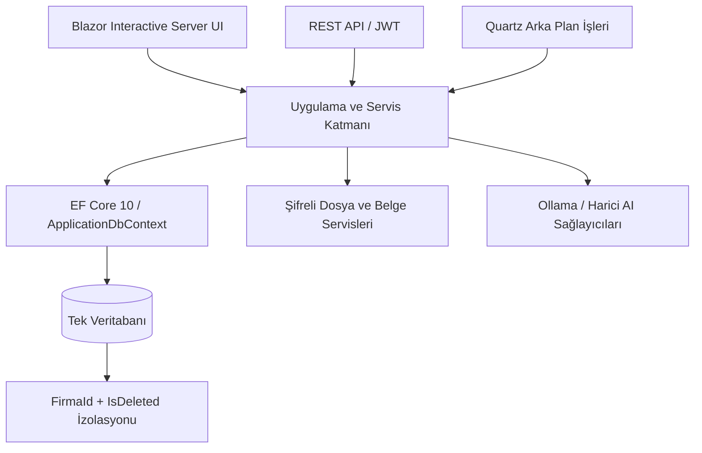

<div align="center">
  
  <h1>MK Filo Servis</h1>
  <p><strong>Personel taşımacılığı operasyonlarını, filodan muhasebeye kadar tek merkezde yöneten kurumsal platform.</strong></p>
  <p>
    <a href="https://dotnet.microsoft.com/"></a>
    <a href="https://learn.microsoft.com/aspnet/core/blazor/"></a>
    <a href="https://learn.microsoft.com/ef/core/"></a>
    <a href="https://www.postgresql.org/"></a>
    <a href="LICENSE"></a>
  </p>
  <p>
    <a href="#öne-çıkan-yetenekler">Özellikler</a> ·
    <a href="#mimari">Mimari</a> ·
    <a href="#hızlı-başlangıç">Kurulum</a> ·
    <a href="#dokümantasyon">Dokümantasyon</a> ·
    <a href="#katkı">Katkı</a>
  </p>
</div>

---

## Genel Bakış

MK Filo Servis; personel taşımacılığı yapan işletmelerin araç, sürücü, güzergâh, puantaj, hakediş, fatura ve muhasebe süreçlerini bütünleşik biçimde yönetmesi için geliştirilmiştir.

Platform, operasyonel veriyi finansal çıktıya kadar aynı akışta taşır:

```text
Araç & Şoför → Güzergâh → Operasyonel Puantaj → Hakediş → Fatura → Muhasebe & Raporlama
```

Tek veritabanı üzerinde `FirmaId` tabanlı veri izolasyonu, rol/yetki kontrolleri, audit kayıtları ve soft-delete yaklaşımıyla çok firmalı yapılara uyum sağlar.

## Öne Çıkan Yetenekler

| Alan | Kapsam |
|---|---|
| **Filo yönetimi** | Araç kartları, sahiplik türleri, plaka geçmişi, bakım, masraf ve evrak takibi |
| **Personel ve şoför** | Özlük dosyaları, izinler, bordro, maaş, belge süreleri ve araç atamaları |
| **Güzergâh ve operasyon** | Güzergâh planlama, sefer tanımları, günlük/aylık puantaj ve operasyon merkezi |
| **İhale ve teklif** | Hat maliyetleri, araç/şoför giderleri, teklif versiyonları ve kârlılık analizi |
| **Hakediş ve fatura** | Puantajdan hakedişe ve faturaya izlenebilir iş akışı, revizyon ve onay süreçleri |
| **Finans ve muhasebe** | Cari, banka/kasa, masraf, tahsilat, hesap planı ve finansal raporlar |
| **EBYS ve belgeler** | Gelen/giden evrak, güvenli dosya saklama, belge sınıflandırma ve süre uyarıları |
| **Raporlama** | Operasyon, maliyet, kârlılık, bordro ve yönetim raporları; Excel/PDF çıktıları |
| **AI destekli işlemler** | Ollama ve yapılandırılabilir sağlayıcılarla tahmin, sınıflandırma ve analiz özellikleri |
| **Kurumsal yönetim** | Organizasyon–firma–şube yapısı, rol bazlı yetki, JWT API ve denetim izi |

## Mimari


```mermaid
flowchart TB
    UI[Blazor Interactive Server UI] --> APP[Uygulama ve Servis Katmanı]
    API[REST API / JWT] --> APP
    JOBS[Quartz Arka Plan İşleri] --> APP
    APP --> EF[EF Core 10 / ApplicationDbContext]
    APP --> FILES[Şifreli Dosya ve Belge Servisleri]
    APP --> AI[Ollama / Harici AI Sağlayıcıları]
    EF --> DB[(Tek Veritabanı)]
    DB --> TENANT[FirmaId + IsDeleted İzolasyonu]
```

### Temel Tasarım Kararları

- **Tek operasyonel bağlam:** Tüm iş verisi `ApplicationDbContext` üzerinden yönetilir.
- **Firma izolasyonu:** Global query filter'lar `FirmaId` ve `IsDeleted` kurallarını uygular.
- **Katmanlı yapı:** UI, servisler, ortak entity/DTO'lar ve veri erişimi ayrıştırılmıştır.
- **İzlenebilir süreçler:** Kritik iş akışlarında audit, revizyon ve durum geçmişi korunur.
- **Çoklu veritabanı sağlayıcısı:** PostgreSQL kanonik üretim hedefidir; SQLite, SQL Server ve MySQL çalışma zamanı seçenekleri mevcuttur.

## Teknoloji Yığını

| Katman | Teknoloji |
|---|---|
| Uygulama | .NET 10, ASP.NET Core, Blazor Interactive Server |
| Veri | Entity Framework Core 10, PostgreSQL, SQLite, SQL Server, MySQL |
| Arka plan işleri | Quartz.NET |
| API ve gerçek zamanlı iletişim | REST, JWT, Swagger/OpenAPI, SignalR |
| Doküman ve çıktı | ClosedXML, EPPlus, QuestPDF |
| AI | Microsoft.Extensions.AI, Ollama ve yapılandırılabilir sağlayıcılar |
| Test ve otomasyon | Playwright, Selenium |
| Dağıtım | Docker, IIS ve Windows kurulum betikleri |

## Hızlı Başlangıç

### Gereksinimler

- [.NET 10 SDK](https://dotnet.microsoft.com/download/dotnet/10.0)
- Git
- İsteğe bağlı: PostgreSQL 14+ ve Ollama

### Yerel geliştirme

```bash
git clone https://github.com/karamur/MKFiloServis-MultiDb.git
cd MKFiloServis-MultiDb
dotnet restore MKFiloServis.slnx
dotnet run --project MKFiloServis.Web --launch-profile http
```

Uygulama varsayılan geliştirme profilinde `http://localhost:5190` adresinden açılır. Yerel başlangıç yapılandırması SQLite kullanır; gerekli veritabanı hazırlıkları uygulama açılışında gerçekleştirilir.

> [!IMPORTANT]
> Geliştirme seed kullanıcısı `admin / admin123` değerleriyle oluşturulabilir. Bu hesabı yalnızca yerel geliştirmede kullanın ve gerçek bir ortamda ilk girişten hemen sonra parolayı değiştirin.

### PostgreSQL ile çalıştırma

PowerShell örneği:

```powershell
$env:DatabaseProvider = "PostgreSQL"
$env:ConnectionStrings__DefaultConnection = "Host=localhost;Port=5432;Database=MKFiloServis;Username=postgres;Password=<PAROLA>"
dotnet run --project MKFiloServis.Web --launch-profile http
```

Kalıcı ortam ayarları için `appsettings.json`, environment variable veya uygulamanın oluşturduğu `dbsettings.json` kullanılabilir. Hassas değerleri repoya eklemeyin.

## Yapılandırma

En sık kullanılan ayarlar:

| Anahtar | Açıklama |
|---|---|
| `DatabaseProvider` | `SQLite`, `PostgreSQL`, `SQLServer` veya `MySQL` |
| `ConnectionStrings:DefaultConnection` | Seçilen sağlayıcının bağlantı dizesi |
| `Jwt:Secret` | En az 32 karakterli, ortama özel JWT anahtarı |
| `Ollama:BaseUrl` | İsteğe bağlı yerel AI servis adresi |
| `Ollama:Model` | Kullanılacak Ollama modeli |
| `Backup:*` | Otomatik yedekleme durumu, dizini ve saklama süresi |

Environment variable karşılıklarında .NET'in çift alt çizgi biçimini kullanın; örneğin `Jwt__Secret` veya `Ollama__BaseUrl`.

> [!WARNING]
> Üretim ortamında örnek parolaları ve JWT anahtarlarını kullanmayın. HTTPS, güçlü veritabanı kimlik bilgileri, kalıcı Data Protection anahtarları ve düzenli yedekleme yapılandırın.

## Derleme ve Doğrulama

```bash
# Ana web uygulamasını derle
dotnet build MKFiloServis.Web/MKFiloServis.Web.csproj

# Çözümdeki projeleri derle
dotnet build MKFiloServis.slnx

# E2E smoke runner (çalışan uygulama adresini ortam değişkeniyle alır)
dotnet run --project MKFiloServis.Web/Tests/PlaywrightSmoke
```

Önemli bir değişikliği göndermeden önce ilgili iş akışını uygulama üzerinden doğrulayın ve mevcut analiz/uyarıları gözden geçirin.

## Proje Yapısı

```text
MKFiloServis-MultiDb/
├── MKFiloServis.Web/              # Blazor uygulaması, API, servisler ve veri erişimi
│   ├── Components/Pages/          # İş modüllerinin kullanıcı arayüzleri
│   ├── Controllers/               # REST API uçları
│   ├── Data/                      # DbContext, migration ve başlangıç verileri
│   ├── Services/                  # Uygulama ve entegrasyon servisleri
│   ├── Tests/PlaywrightSmoke/     # Uçtan uca smoke test runner'ı
│   └── wwwroot/                   # Statik dosyalar
├── MKFiloServis.Shared/           # Ortak entity, enum ve veri modelleri
├── MKFiloServis.DataSync/         # Veri aktarım/uyumluluk masaüstü aracı
├── MKFiloServis.LisansDesktop/    # Windows lisans yönetim aracı
├── docs/                          # Alan dokümanları ve mimari karar kayıtları
├── setup/                         # Kurulum paketi tanımları
├── docker-compose.yml             # Konteyner servis tanımları
└── MKFiloServis.slnx              # Çözüm tanımı
```

## Dokümantasyon

| Kaynak | İçerik |
|---|---|
| [Kurulum kılavuzu](INSTALL.md) | Sunucu, veritabanı ve dağıtım adımları |
| [Geliştirme notları](DEVELOPMENT.md) | Aktif geliştirme kayıtları ve teknik handoff bilgileri |
| [Kullanıcı kılavuzu](docs/KULLANICI-KILAVUZU.md) | Son kullanıcı iş akışları |
| [Mimari karar kayıtları](docs/adr/README.md) | Önemli teknik kararların gerekçeleri |
| [Katkı rehberi](CONTRIBUTING.md) | Branch, commit, kod ve PR standartları |
| [Güvenlik politikası](SECURITY.md) | Güvenlik açığı bildirim süreci |
| [Değişiklik günlüğü](CHANGELOG.md) | Sürüm ve özellik geçmişi |

## Güvenlik

Güvenlik açıklarını herkese açık issue olarak paylaşmayın. GitHub'ın özel güvenlik bildirimi kanalını veya depo sahibiyle özel iletişimi kullanın. Ayrıntılar için [SECURITY.md](SECURITY.md) dosyasına bakın.

## Katkı

1. Değişiklik için kısa ömürlü bir branch oluşturun.
2. Kod stiline ve mevcut mimari sınırlara uyun.
3. Derleme ve ilgili senaryoları doğrulayın.
4. Conventional Commits biçiminde commit oluşturun.
5. Kapsamı ve doğrulama sonuçlarını açıklayan bir pull request açın.

Ayrıntılı süreç ve örnekler [CONTRIBUTING.md](CONTRIBUTING.md) içinde yer alır.

## Lisans

Bu proje açık kaynak lisansıyla dağıtılmamaktadır. Kaynak kod Allbatros Global Teknoloji'ye aittir ve kullanımı [LICENSE](LICENSE) koşullarına tabidir.

---

<div align="center">
  <strong>MK Filo Servis</strong><br />
  <sub>Operasyondan finansa, filonun tüm yaşam döngüsü tek platformda.</sub>
</div>
